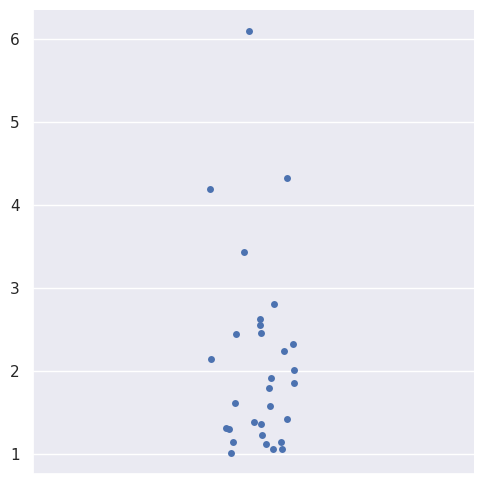

# The Box-Cox Transform


For this post we will be showing how the box-cox transform acts on skewed data.

The idea is that given data with some sort of skew, we can use a box-cox transform to make it more normally distributed.

From Wikipedia, we have the box cox transform:

$$y_i^{(\lambda)} =
\begin{cases}
 \dfrac{y_i^\lambda - 1}{\lambda} & \text{if } \lambda \neq 0, \\
 \ln y_i & \text{if } \lambda = 0,
\end{cases}
$$


https://en.wikipedia.org/wiki/Power_transform#Box%E2%80%93Cox_transformation

,

where lambda is a parameter that we can vary until our transformed data is approximately normally distributed.


```python
import numpy as np
import matplotlib.pyplot as plt
import seaborn as sns
import matplotlib.animation as animation

sns.set_theme()

```

First we generate some skewed data from an F distribution. Fisrt we plot a kde plot of the data, and then a strip plot.


```python
def skewed_kde():

  m=30
  a = 1+np.random.f(2,10, m)

  sns.kdeplot(a)
  sns.rugplot(a)
  # plt.savefig('skewed_kde_data.png',bbox_inches='tight')

  plt.show()
np.random.seed(0)
skewed_kde()
```


    

    


```python
def skewed_strip():
  m=30

  a = 1+np.random.f(2,10, m)

  sns.catplot(a)

  # plt.savefig('skewed_strip_data.png',bbox_inches='tight')
  plt.show()
np.random.seed(0)
skewed_strip()

```


    

    


### Box-Cox Transform


Below is the transform we will be applying.

From Wikipedia, we have the box cox transform:

$$y_i^{(\lambda)} =
\begin{cases}
 \dfrac{y_i^\lambda - 1}{\lambda} & \text{if } \lambda \neq 0, \\
 \ln y_i & \text{if } \lambda = 0,
\end{cases}
$$


https://en.wikipedia.org/wiki/Power_transform#Box%E2%80%93Cox_transformation

,

where lambda is a parameter that we can vary until our transformed data is approximately normally distributed.

### The Transform

The function below transforms data based on the parameter lambda.


```python
def my_box_cox(y , lambda_):

  if lambda_ == 0:
    y_new = np.log(y)
  else:
    y_new = (y**lambda_ - 1) / lambda_

  return y_new
```

### Transforming Skewed Data

Using our box cox transform function, we can transform skewed data.

Before applying our transform, we will try transforming our data using a logarithm.


```python
np.random.seed(0)
m=30
a = 1+np.random.f(2,10, m)
b = np.log(a)
sns.catplot([a ,b], orient='v')
plt.xticks([0,1] , ['data' , 'transformed'])
plt.show()
```


    

    


```python
sns.violinplot([a ,b], orient='v')
plt.xticks([0,1] , ['data' , 'transformed'])
plt.show()
```


    

    


The above violin plot shows that by applying a logarithm, our data becomes more symmetric.

Now we will apply our box cox transofrm with different values of lambda.


```python
def show_boxcox_transform_catplot(m,lambda_):

  a = 1+np.random.f(2,10, m)
  b = my_box_cox(a,lambda_)


  sns.stripplot([a ,b], orient='v').set_title(f'lambda = {lambda_}')
  g = plt.xticks([0,1] , ['data' , 'transformed'])


  plt.show()
  return g
```

We can look at an animated plot to see what the box cox transform does to our data at different values of lambda:


With lambda set to zero, our transformation is the same as applying a logarithm:


```python
np.random.seed(0)
show_boxcox_transform_catplot(m =30,lambda_ = 0);

```


    

    


Other values of lambda:


```python
np.random.seed(0)
show_boxcox_transform_catplot(m =30,lambda_ = 1);
```


    

    


```python
np.random.seed(0)
show_boxcox_transform_catplot(m =30,lambda_ = 0.5);
```


    

    


```python
np.random.seed(0)
show_boxcox_transform_catplot(m =30,lambda_ = -1);
```


    

    


```python
np.random.seed(0)
show_boxcox_transform_catplot(m =30,lambda_ = -2);
```


    

    


# Code to make the Animation  

graphing and what not


```python
import numpy as np
import matplotlib.pyplot as plt
import seaborn as sns
import matplotlib.animation as animation
```


```python
m = 30
lambda_ = 2


fig , ax = plt.subplots()

np.random.seed(0)
a = 1+np.random.f(2,10, m)
b = my_box_cox(a,lambda_)

sns.stripplot([a ,b], orient='v' , ax = ax)
ax.set_xticks([0,1] , ['data' , 'transformed'])
ax.set_title(f'lambda = {lambda_}')

ax.set_ylim(top=a.max()+1)


def update(frame):
    # for each frame, update the data stored on each artist.


    b = my_box_cox(a , lambda_ - frame*0.1)

    # print(ax.collections[1].get_offsets().data.shape)

    data = ax.collections[1].get_offsets().data


    if type(data) == 'numpy.ndarray':


      data[:,1] = b
      ax.collections[1].set_offsets(data)
    else:
      data2 = np.array(data)
      data2[:,1] = b
      ax.collections[1].set_offsets(data2)

      # print(xs.shape)

      # data = np.stack([xs,b]).T
    ax.set_title(f'lambda = {np.round(lambda_ - frame*0.1, 2)}')


    return ax


ani = animation.FuncAnimation(fig=fig, func=update, frames=40, interval=100)


#Uncomment to save animation:
# ani.save(filename="moving_strip_post.gif", writer="pillow")
```
