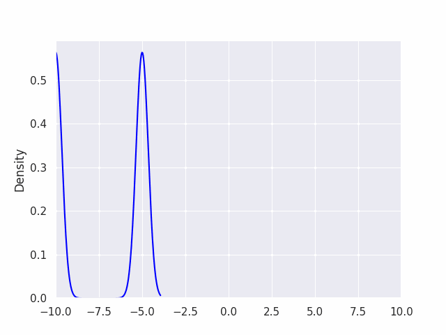

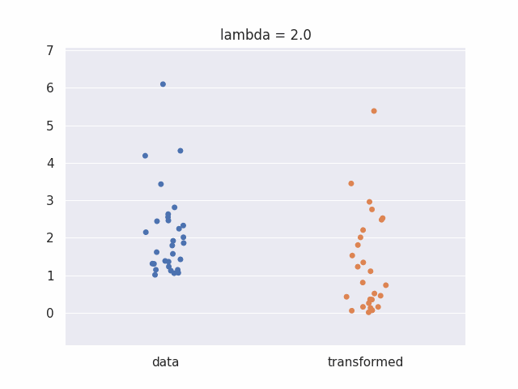


### Model:

$\hat{y} = b + wx $


```python
import numpy as np
import matplotlib.pyplot as plt
import seaborn as sns
```


```python
def normal_vs_skewed_kde():
  m=30
  a = 1+np.random.f(4,5, m)

  sns.kdeplot(a)
  sns.rugplot(a)


  plt.show()
normal_vs_skewed_kde()
```


    
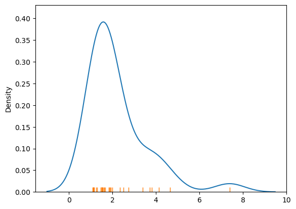
    


```python
def normal_vs_skewed_hist():
  m=30
  a = 1+np.random.f(4,10, m)

  sns.histplot(a)

  plt.show()
normal_vs_skewed_hist()
```


    
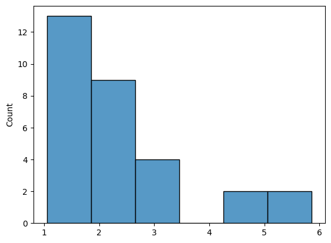
    


```python
m=30
a = 1+np.random.f(2,10, m)

sns.catplot(a)

plt.savefig('skewed_data.png',bbox_inches='tight')
plt.show()
```


    
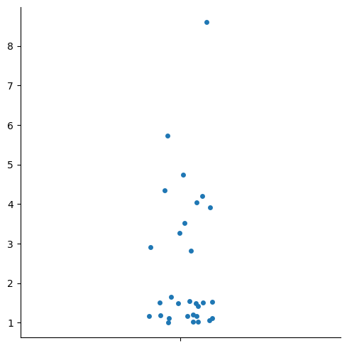
    


```python
def normal_vs_skewed_cat():
  m=30
  a = 1+np.random.f(2,10, m)

  sns.catplot(a)

  plt.show()
normal_vs_skewed_cat()

```


    
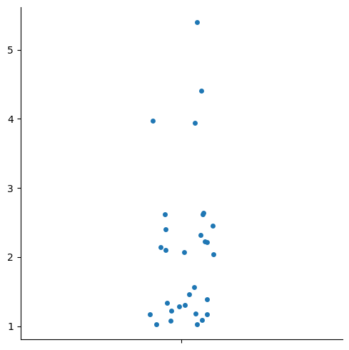
    


### Box Cox Project

For this project we will be showing how the box cox transform acts on data.

The idea is that given data with some sort of skew, we can use a boxcox transform to make it more normally distributed.

From Wikipedia, we have the box cox transform:

$$
y_i^{(\boldsymbol{\lambda})} =
\begin{cases}
 \dfrac{(y_i + \lambda_2)^{\lambda_1} - 1}{\lambda_1} & \text{if } \lambda_1 \neq 0, \\
 \ln (y_i + \lambda_2) & \text{if } \lambda_1 = 0,
\end{cases}
$$

https://en.wikipedia.org/wiki/Power_transform#Box%E2%80%93Cox_transformation

,

where lambda is a parameter that we can vary until our transformed data is approximately normally distributed.

### The Transform

The function below transforms data based on the parameter lambda.


```python

```


```python
def my_box_cox(y , lambda_):

  if lambda_ == 0:
    y_new = np.log(y)
  else:
    y_new = (y**lambda_ - 1) / lambda_

  return y_new
```

### Transforming Skewed Data


```python
X = np.random.normal(loc = [1,-2,0] ,size = (50,3))
```


```python
X.shape
```


    (50, 3)


```python
X.mean(axis = 0)
```


    array([ 0.92678783, -1.87336483, -0.12395358])


```python
sns.set_theme()

```


```python
sns.catplot(X,alpha = 0.5)
sns.pointplot(X,color = 'r')

```


    <Axes: >


    
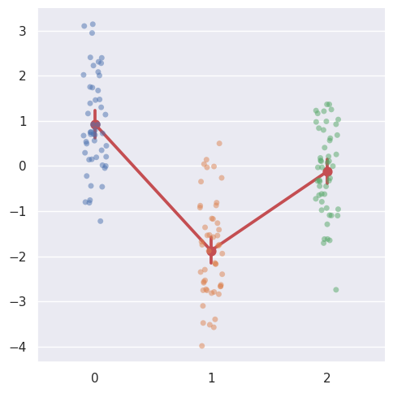
    


```python
np.random.seed(0)
m=30
a = 1+np.random.f(2,10, m)
b = np.log(a)
sns.catplot([a ,b], orient='v')
plt.xticks([0,1] , ['data' , 'transformed'])
plt.show()
```


    
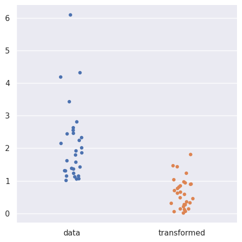
    


```python
sns.violinplot([a ,b], orient='v')
plt.xticks([0,1] , ['data' , 'transformed'])
plt.show()
```


    
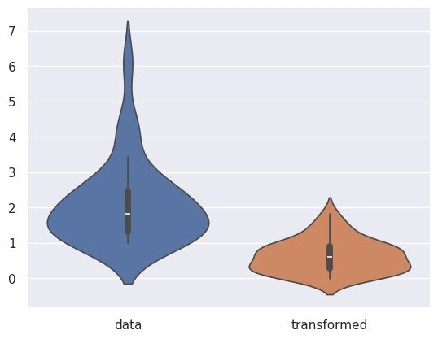
    


```python

```


    array([1.11797189, 0.68693208, 1.56574684, 0.43717799, 0.37386712,
           1.68380426, 1.66336645, 2.03922304, 1.21561423, 0.28855936,
           0.83102207, 2.33238698, 2.93672605, 1.13556433, 0.25622856,
           0.57509258, 2.27534419, 0.65883192, 3.40247732, 1.23693247,
           1.07696004, 0.56444365, 0.42838581, 0.14484553, 0.74459117,
           0.10685591, 0.78317849, 0.99720911, 1.01685557, 0.47815459])


```python
def show_boxcox_transform_catplot(m,lambda_):

  a = 1+np.random.f(2,10, m)
  b = my_box_cox(a,lambda_)


  sns.catplot([a ,b], orient='v')
  g = plt.xticks([0,1] , ['data' , 'transformed'])
  plt.show()
  return g
```


```python
show_boxcox_transform_catplot(m =30,lambda_ = 0)
```


    ---------------------------------------------------------------------------

    NameError                                 Traceback (most recent call last)

    <ipython-input-7-4a1c0c3c55d9> in <cell line: 1>()
    ----> 1 show_boxcox_transform_catplot(m =30,lambda_ = 0)
    

    <ipython-input-6-c31948aefe64> in show_boxcox_transform_catplot(m, lambda_)
          2 
          3   a = 1+np.random.f(2,10, m)
    ----> 4   b = my_box_cox(a,lambda_)
          5 
          6 


    NameError: name 'my_box_cox' is not defined


```python
import plotly.express as px
# df = px.data.gapminder()
px.scatter(df, x="gdpPercap", y="lifeExp", animation_frame="year", animation_group="country",
           size="pop", color="continent", hover_name="country",
           log_x=True, size_max=55, range_x=[100,100000], range_y=[25,90])
```


```python
import matplotlib.animation as animation
```


```python

```


```python
plt.scatter(a,np.log(a))
```


    <matplotlib.collections.PathCollection at 0x79fd0b536e00>


    
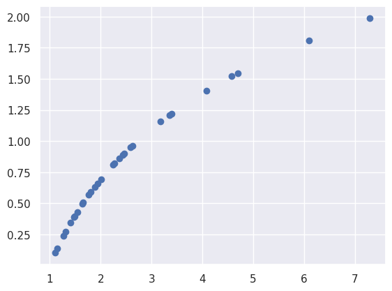
    


```python
import numpy as np
import matplotlib.pyplot as plt
import seaborn as sns
import matplotlib.animation as animation
```


```python
t.shape
```


    (40,)


```python
fig, ax = plt.subplots()
t = np.linspace(0, 3, 40)
g = -9.81
v0 = 12
z = g * t**2 / 2 + v0 * t

v02 = 5
z2 = g * t**2 / 2 + v02 * t

scat = ax.scatter(t[0], z[0], c="b", s=5, label=f'v0 = {v0} m/s')
line2 = ax.plot(t[0], z2[0], label=f'v0 = {v02} m/s')[0]
ax.set(xlim=[0, 3], ylim=[-4, 10], xlabel='Time [s]', ylabel='Z [m]')
ax.legend()


def update(frame):
    # for each frame, update the data stored on each artist.
    x = t[:frame]
    y = z[:frame]
    # update the scatter plot:
    data = np.stack([x, y]).T
    scat.set_offsets(data)
    # update the line plot:
    line2.set_xdata(t[:frame])
    line2.set_ydata(z2[:frame])
    return (scat, line2)


ani = animation.FuncAnimation(fig=fig, func=update, frames=40, interval=30)

ani.save(filename="pillow_example.gif", writer="pillow")

```


    
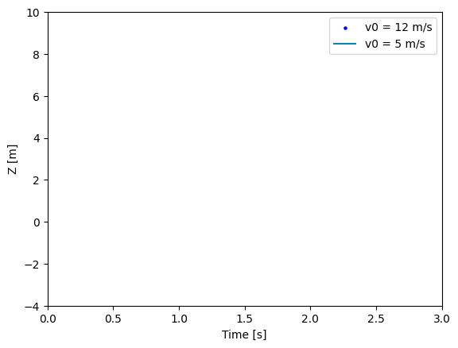
    

