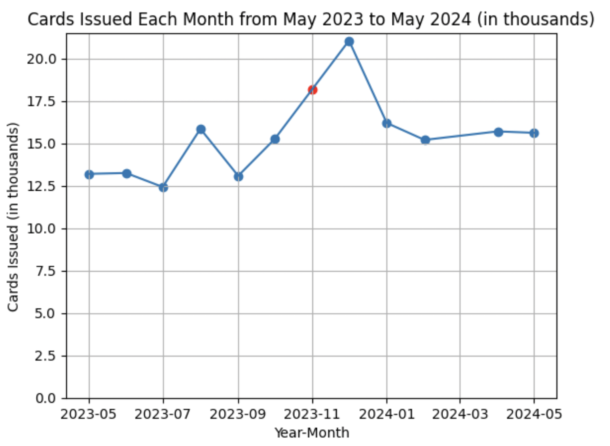

# IDNYC Data Analysis

Approximately 2.2 million IDNYC cards have been issued since 2015. 

Using data from NYC OpenData, we can graph the number of IDNYC cards issued each year. Each row in our dataset contains the number of cards issued each month, so we can downsample our data to a yearly basis, and then plot it. 

After an initial spike, the number of cards issued each year stabilize to between one hundred thousand and two hundred thousand. 

Do you think the pattern will continue? 

About the chart:

The number of cards issued for the year 2024 is left off the chart because the year is not over yet, and the number would look artificially low.

The monthly values for 2024 don't look very different from 2023 or 2022:

About the data:

During the year 2023, there is no row for the month of November, so it is not clear whether no cards were issued that month, or that the number of cards issued was not reported for that month. December has a spike that is 33% greater than the month of October, but I don't think this gives any information on the missing month.

We can use the midpoint of cards issued in October 2023 and December 2023  to estimate the cards issued for November 2023:

The red dot represents the midpoint estimate for the number of cards issued in November 2023. This estimate was not used when plotting the yearly totals of cards issued in the first graph.

If we take the midpoint of the cards issued for October 2023 and December 2023, and add it on to the total yearly value for 2023, we would go from around 160,000 to around 180,000 cards issued. Either way, this value does not differ too much from the cards issued in 2022.

The source for this data can be found on:

https://data.cityofnewyork.us/Social-Services/IDNYC-Applications-and-Cards-Issued/rtmc-bhid/about_data

Any comments, critiques, or questions, feel free to message me on Linkedin.
