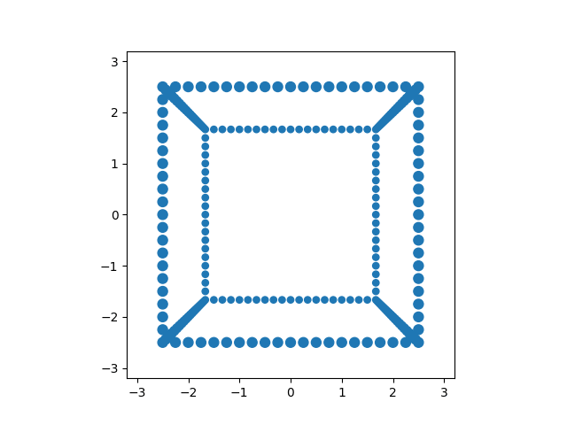

  <a class="active" href="#home">Home</a>
  <a href="#news">News</a>
  <a href="#contact">Contact</a>
  <a href="#about">About</a>

## Eric Connelly's Website
{:.no_toc}

Welcome to Eric Connelly's website! 
I have a Bachelor of Science in Mathematics from The City University of New York, College of Staten Island.

I work on all sorts of things, many mathematical or algorithmic. 

<!--
[Simple Drawing Tool](https://eric-conn.github.io/DrawingApp/index3.html)
-->

Tool to draw graph theory graphs: 
[Graph Maker](https://eric-conn.github.io/GraphMaker/GraphMaker.html)
(not done, need to add a way to save graphs).

## About me:
{:.no_toc}
I am looking for a role in data science , data analytics, or machine learning. I have a background in mathematics and programming, with my preferred language as Python. I am currently a mathematics and statistics tutor at The Fashion Institute of Technology. I also tutor students in data analysis and machine learning.

Contact me on [Linkedin](https://www.linkedin.com/in/eric-connelly-685525212/)!

Check out my Github: [Github](https://github.com/Eric-Conn)

### Idea list
{:.no_toc}

Some things I want to do/ need to start/ finish.

Random Walk generator
Graph Decomposer (Factorizer)
Voxel Orientation Detector
CNN Learning Process
Backpropagator Graph
Trajectory Decomposer
Trajectory averager with thresholder.

## Portfolio

## Blog Posts
{:.no_toc}
Check out my blog posts:

[IDNYC Data Analysis](https://eric-conn.github.io/IDNYC_Post)

[Trend and Noise](https://eric-conn.github.io/Trend_and_Noise)

## Notebooks
{:.no_toc}

[Staten Island Ferry Ridership Data Analysis](https://github.com/Eric-Conn/StatenIslandFerryProject/blob/main/StatenIslandFerry_Notebook.ipynb)

[MegaMillions Data Analysis](https://github.com/Eric-Conn/MegaMillionsAnalysisProject/blob/master/Lottery_Notebook.ipynb)

## Overview of Some Projects
{:.no_toc}
Here is a brief overview of my projects. Some are still a work in progress. Feel free to message me or email me if you have any comments, criticisms, or questions.

* TOC
{:toc}

# NYC Ferry Data Time Series Forecasting

Suppose we are data analysts working for the NYC Ferry. One goal of the NYC Ferry may be to predict boarding numbers and revenue for the next year in order to allocate resources efficiently.
Ferry ridership fluctuates up and down each year, so it's important to know if there are any trends, and what changes are due to trends and what changes are due to seasonality, if any, and also, what behaviour can be attributed to random fluctuations with a noisy pattern.

So, for this project we used time series methods to decompose our data into a trend component, a seasonal component, and a irregular component, and used this decomposition to create predictions for the NYC Ferry system boarding numbers for the next year.

Note: I have no affiliation with the NYC Ferry.

[NYC Ferry Forecasting](https://github.com/Eric-Conn/NYCFerryData_TimeSeriesForecasting/blob/master/FerryDataFinalReport.ipynb)

See the full notebook here: https://github.com/Eric-Conn/NYCFerryData_TimeSeriesForecasting/blob/master/FerryDataFinalReport.ipynb

# U.S. Food Imports Data Time Series Analysis

This project is not done.

For this project we used transformed the dataset into a time series and then use exponetial smoothing to make future predictions.

Note: I have no affiliation with the U.S. Government.

