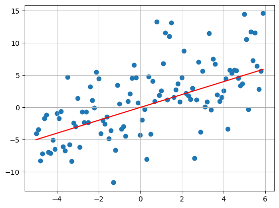

# Trend and Noise


## Introduction

Using Numpy and Matplotlib, we can generate graphs consisting of a deterministic trend and a random noise component.
We will only be focusing on polynomial trends for this project. The noise will be sampled from a normal distribution.


## Code


```python
import numpy as np
import matplotlib.pyplot as plt
```


```python
def my_plot(

  #The x-axis bounds of our graph will be -T , T.
  T = 5,

  # Controls the granulairty of the x-axis.
  delta = 0.1,

  #The standard deviation of the noise component;
  #controls the "spread" of the noise.
  sigma = 4,

  #The coefficients of our polynomial trend.
  bs = [2,-1,1,-0.5]
  ):

  #The degree - 1
  d = len(bs)

  #The domain of our polynomial
  ts = np.arange(-T , T + 1,step = delta)


  #Generating the values for each term in our polynomial.
  s = 0

  for i in range(d):
    s += (ts**i * bs[i])


  #Adding on the noise component.
  x = s + np.random.normal(0,sigma,len(ts))

  #Plotting
  plt.scatter(ts,x)
  plt.plot(ts,s,color = 'r')
  plt.grid(True)
  plt.show()
```

## Examples


```python
#Cubic Trend

my_plot(
  T = 5,
  delta = 0.1,
  sigma = 4,
  bs = [0.2,-1,1,-1]
  )
```

    

    


```python
#Qudratic Trend

my_plot(
  T = 5,
  delta = 0.1,
  sigma = 4,
  bs = [0,-1,1]
  )

```


    

    


```python
#Linear Trend

my_plot(
  T = 5,
  delta = 0.1,
  sigma = 4,
  bs = [0,1]
  )
```


    

    


```python
#Quintic
u = np.random.uniform(-1,1,size = 6)
my_plot(
  T = 5,
  delta = 0.1,
  sigma = 2,
  bs = u
  )
print(u)
```


    

